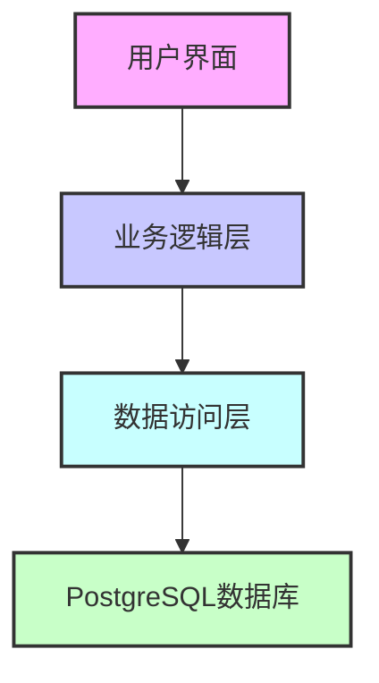

## 技术架构图

```mermaid
graph TD
    A[用户界面] --> B[业务逻辑层]
    B --> C[数据访问层]
    C --> D[PostgreSQL数据库]
    style A fill:#f9fc,stroke:#333,stroke-width:2px
    style B fill:#bbfc,stroke:#333,stroke-width:2px
    style C fill:#bffc,stroke:#333,stroke-width:2px
    style D fill:#bfbc,stroke:#333,stroke-width:2px
```
